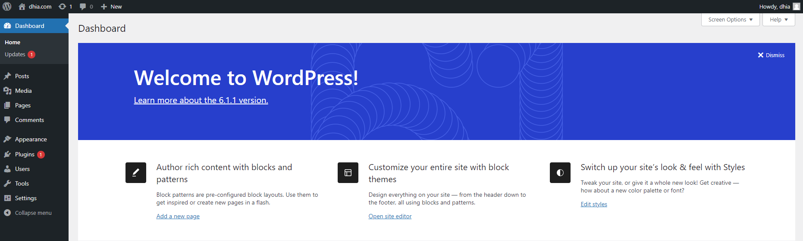
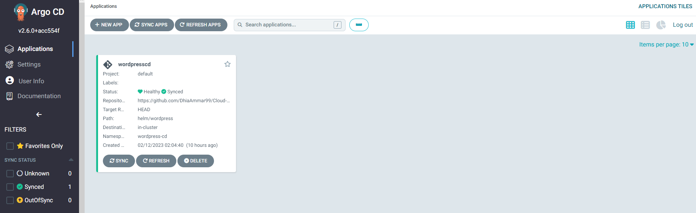

# Cloud Project  GCP, Terraform and Argocd

In this project we aim automate the deployment of a **Kubernetes** cluster on gcp with **Terraform**, after that we will deploy **Wordpress** with **helm** ( with 2 different ways using a bitnami repo & and by ceating our on chart).The last step is to automte the deployment with **ArgoCD**.

## Prerequisite
 - GCP Account
 - Google cloud cli installed 
 - Terraform installed

## Let's get started
### 1- Deploy VPC, Subnet and K8S Cluster with Terraform :
First step is to set the project property in the core section, run:

    gcloud config set project <PROJECT_ID>

Command output :

    Updated property [core/project].
   
Now we need to initializes the directory containing Terraform configuration files

    terraform init

To execute the actions proposed in our terraform files we execute (this may take couple of minutes):

    terraform apply

Expected output

       Apply complete! Resources: 4 added, 0 changed, 0 destroyed.
        kubernetes_cluster_host = "ip"
        kubernetes_cluster_name = "gke-clustername"
        project_id = "cloud-project-id"
        region = "us-central1"
Now that we provisined GKE cluster, we need to configure kubectl:  
  
    gcloud container clusters get-credentials cloud-project-376908-gke --region us-central1 --project cloud-project-376908

Expected output

    Fetching cluster endpoint and auth data.
    kubeconfig entry generated for <project id>.

In this step we have a K8s Cluster with Kubectl we still need to [install Helm](https://helm.sh/docs/intro/install/).

### 2- Deploy Wordpress with Bitnami Repo : 

First method i will use bitanmi repo for that we use the following command :

    helm repo add bitnami https://charts.bitnami.com/bitnami

To verify that the repo has been added to our list run this :

    helm repo list
    
 We start by creating a wordpress directory and helm values file that will contain only the basic configurations Wordpress credintials such as ( wordpressUsername,wordpressPassword ...)

    mkdir wordpress

    touch wordpress-values.yaml
 
file content :

    wordpressUsername: dhia
    wordpressPassword: dhia
    wordpressEmail: dhia@ammar.com
    wordpressFirstName: dhia
    wordpressLastName: ammar
    wordpressBlogName: dhia.com
    service:
    type: LoadBalancer

  

we need a dedicated namespace for wordpress

    kubectl create namespace nswordpress

To verify run

    kubectl get ns

Now we need to find a stable version of wp to use through this command that provides a search for Helm charts in various places

    helm search repo wordpress --versions

once we pick our version we run this command to install wp inside the cluster, it is important to save the output of the following command somewhere

    helm install wordpress bitnami/wordpress --values=wordpress-values.yaml --namespace nswordpress --version 15.2.37

Expected output
    
    NOTE: It may take a few minutes for the LoadBalancer IP to be available.
    Watch the status with: 'kubectl get svc --namespace nswordpress -w wordpress'
    export SERVICE_IP=$(kubectl get svc --namespace nswordpress wordpress --template "{{ range (index .status.loadBalancer.ingress 0) }}{{ . }}{{ end }}")
    echo "WordPress URL: http://$SERVICE_IP/"
    echo "WordPress Admin URL: http://$SERVICE_IP/admin"
    2. Open a browser and access WordPress using the obtained URL.
    3. Login with the following credentials below to see your blog:
    echo Username: dhia
    echo Password: $(kubectl get secret --namespace nswordpress wordpress -o jsonpath="{.data.wordpress-password}" | base64 -d)

lets verify wordpress created objects

    kubectl get all --namespace nswordpress
    
We are almost there we just need to run the commands that we saved from last step :

    export SERVICE_IP=$(kubectl get svc --namespace nswordpress wordpress --template "{{ range (index .status.loadBalancer.ingress 0) }}{{ . }}{{ end }}")
    echo "WordPress URL: http://$SERVICE_IP/"
    echo "WordPress Admin URL: http://$SERVICE_IP/admin"
    

In this level everthing should be working fine ! all you have to do is to check URL.

### 3- Create our own Chart for Wordpress : 
This method is also easy somehow thanks to helm but we will create our own k8s manifest.
A chart is organized as a collection of files inside of a directory. Helm expects such structure :

now that we have all the manfiest we can install using the command

    helm install wordpress wordpress/

 
To verify the website get ExternalIP from the following command

    kubectl get svc
    
To delete everything 

    helm uninstall wordpress wordpress/

  
###  ArgoCd Continuous Deployment
That was too much of command, lets get the CD to make things even easier.

With the argocd.yaml manifest we wont have even to deploy anything, argocd will connect to our github repo and do everything for us for free. Also keep an eye on our project with comparing the Manifest from github with the state of the application.

For example if we added a new deployment configuration in github argocd will automataclly dectect it and the new deployment.

To install argocd on K8s :

    kubectl create namespace argocd
    kubectl apply -n argocd -f https://raw.githubusercontent.com/argoproj/argo-cd/stable/manifests/install.yaml
    kubectl patch svc argocd-server -n argocd -p '{"spec": {"type": "LoadBalancer"}}'
    
Now we can acess the web interface.
The Url : 

    kubectl get service argocd-server -n argocd --output=jsonpath='{.status.loadBalancer.ingress[0].ip}'
Password:

    kubectl -n argocd get secret argocd-initial-admin-secret -o jsonpath="{.data.password}" | base64 -d

Now we have Argocd, the last part is to deploy the Manfiest !

    kubectl apply -f argocd.yaml

we can chechk ArgoCD interface and we find a new application created

